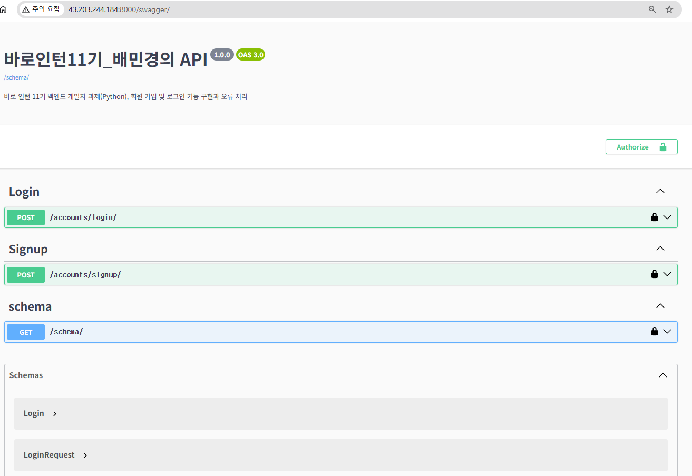

# 🔌 *intern_11th 백엔드 개발자(Python) 과제*
과제 요구사항 링크 ↓
[🙋🏻‍♀️ 백엔드 개발자 과제(Python)](https://teamsparta.notion.site/Python-1ad2dc3ef51481c89e92d6bf1020d3e6)

---
## API 명세서
|기능|Method|URL|request(200)|response(200)|request(400)|response(400)|200 Image URL|400 Image URL|
|-----|-----|-----|-----|-----|-----|-----|-----|-----|
|Signup|POST|/swagger/#/Signup/accounts_signup_create|```{"username":"Minkyung", "password":"12341234", "nickname":"Minkyung"}```|```{"username":"Minkyung", "nickname":"Minkyung", "access":"...", "refresh":"..."}```|```{"username":"Minkyung", "password":"12341234", "nickname":"Minkyung"}```|```{"username": ["A user with that username already exists."]}```|[200-Signup](https://github.com/minkyungbae/intern_11th/blob/main/image/swagger/signup/swagger-do-signup2.png)|[400-signup](https://github.com/minkyungbae/intern_11th/blob/main/image/swagger/signup/error/swagger-signup-already-exists-error.png)|
|Login|POST|/swagger/#/Login/accounts_login_create|```{"username":"Minkyung", "password":"12341234"}```|```{"token":"..."}```|username error : ```{"username":"Minkyung3", "password":"12341234"}```, password error: ```{"username":"Minkyung", "password":"1234123"}```|```{"error": {"code": "INVALID_CREDENTIALS","message": "아이디 또는 비밀번호가 올바르지 않습니다."}}```|[200-login](https://github.com/minkyungbae/intern_11th/blob/main/image/swagger/login/swagger-do-login2.png)|[400-login](https://github.com/minkyungbae/intern_11th/blob/main/image/swagger/login/error/swagger-login-invalied-error-result.png)|

---

## *Swagger Main page*

> **Schema를 확인할 수 있고 Signup API와 Login API를 테스트할 수 있습니다.**

---

## *Pytest*
> **pytest 파일은 "accounts/tests/"에 있습니다.** <br>
> [test_signup.py](https://github.com/minkyungbae/intern_11th/blob/main/accounts/tests/test_signup.py) <br>
> [test_login.py](https://github.com/minkyungbae/intern_11th/blob/main/accounts/tests/test_login.py)


```
(env) PS C:\Users\...\Desktop\...\intern_11th> pytest
======================================= test session starts =======================================
platform win32 -- Python 3.13.0, pytest-8.3.5, pluggy-1.5.0
django: version: 5.2, settings: main.settings (from ini)   
rootdir: C:\Users\...\Desktop\...\intern_11th
configfile: pytest.ini
plugins: django-4.11.1
collected 6 items

accounts\tests\test_login.py ...                                                           [50%]
accounts\tests\test_signup.py ...                                                         [100%]

======================================= 6 passed in 6.10s =======================================

```
---
## *Auth 오류 처리*

```python
from rest_framework_simplejwt.exceptions import (
    TokenError,
    InvalidToken,
    ExpiredTokenError
    )

# 토큰 에러
    def handle_token_error(self, error_type):
        # 토큰 만료
        if error_type == "TOKEN_EXPIRED":
            return Response({
                    "error": {
                        "code": "TOKEN_EXPIRED",
                        "message": "토큰이 만료되었습니다."
                    }}, status=status.HTTP_400_BAD_REQUEST)
        # 토큰을 못 찾은 경우
        elif error_type == "TOKEN_NOT_FOUND":
            return Response({
                    "error": {
                        "code": "TOKEN_NOT_FOUND",
                        "message": "토큰이 없습니다."
                    }}, status=status.HTTP_400_BAD_REQUEST)
        # 유효하지 않는 토큰일 경우
        elif error_type == "INVALID_TOKEN":
            return Response({
                "error": {
                    "code": "INVALID_TOKEN",
                    "message": "토큰이 유효하지 않습니다."
                }}, status=status.HTTP_400_BAD_REQUEST)
        
    # 인증된 토큰일 경우와 예외 처리
    def authenticate_token(self, token):
        try:
            RefreshToken(token)
        except ExpiredTokenError:
            return self.handle_token_error("TOKEN_EXPIRED")
        except InvalidToken:
            return self.handle_token_error("INVALID_TOKEN")
        except TokenError:
            return self.handle_token_error("TOKEN_NOT_FOUND")
```

---
## *폴더 구조*

```
intern_11th
├─ accounts                             <- signup과 login 기능 구현 앱
│  ├─ admin.py
│  ├─ apps.py
│  ├─ migrations
│  │  ├─ 0001_initial.py
│  │  └─ __init__.py
│  ├─ models.py
│  ├─ serializers                       <- 사용한 serializers 분리
│  │  ├─ loginserializers.py            <- login serializers.py
│  │  ├─ signupserializers.py           <- signup serializers.py
│  │  └─ __init__.py
│  ├─ tests                             <- pytest를 위한 test 폴더
│  │  ├─ test_login.py                  <- pytest login.py
│  │  └─ test_signup.py                 <- pytest signup.py
│  ├─ urls.py
│  ├─ views                             <- 사용한 views 분리
│  │  ├─ login_views.py                 <- login views.py
│  │  └─ signup_views.py                <- signup views.py
│  └─ __init__.py
├─ image                                <- README.md에 사용할 이미지 관리 폴더
│  ├─ distribute                        <- 배포 이미지 관리 폴더
│  │  └─ IPv4-swagger-server.png        <- 배포 url에서의 swagger 메인 화면 사진
│  └─ swagger
│     ├─ login                          <- swagger의 로그인 페이지 소개 및 로그인 과정 사진
│     │  ├─ error                       <- login error 이미지
│     │  │  └─ swagger-login-invalied-error-result.png
│     │  ├─ swagger-do-login.png
│     │  ├─ swagger-do-login2.png
│     │  └─ swagger-login-page.png
│     ├─ signup                         <- swagger의 회원가입 페이지 소개 및 회원가입 과정 소개
│     │  ├─ error                       <- signup error 이미지
│     │  │  └─ swagger-signup-already-exists-error.png
│     │  ├─ swagger-do-signup.png
│     │  ├─ swagger-do-signup2.png
│     │  └─ swagger-signup-page.png
│     └─ swagger-main-page.png
├─ main                                 <- Django 프로젝트 관리 앱
│  ├─ asgi.py
│  ├─ settings.py
│  ├─ urls.py
│  ├─ wsgi.py
│  └─ __init__.py
├─ manage.py
├─ pip-install.txt                      <- pip install 명령어 정리
├─ README.md
└─ requirements.txt                     <- 해당 코드를 사용 시, 요구되는 pip list

```